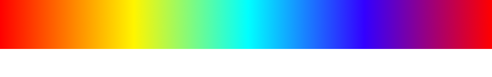
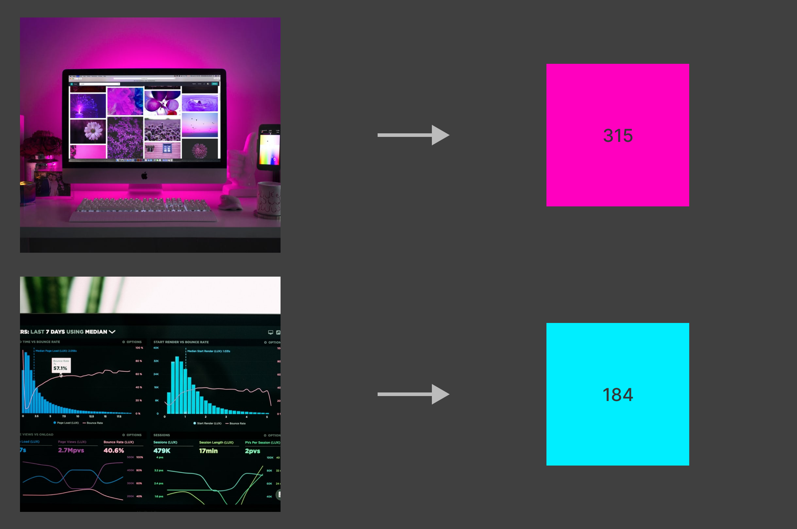

# Dominant-Color-In-Image

This is a sub-project of my project that extracts the dominant color's **HUE** from an image given as input.

## Application
This can be used while developing websites to dynamically add colour to match the appearance of the image.

## Requirements

```
python==3.8.10
Pillow==9.1.1
colorsys
```

## Results

<br>
<br>


